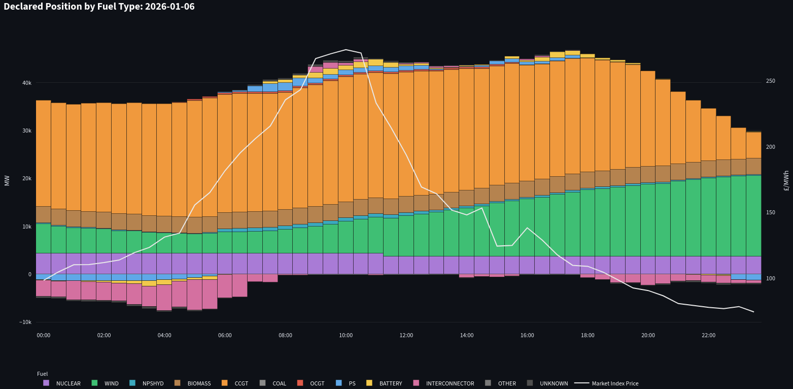
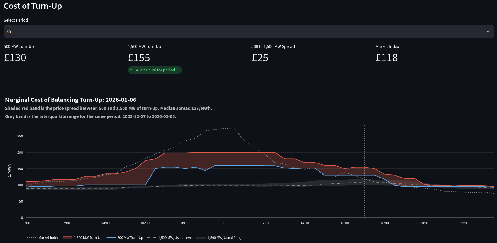
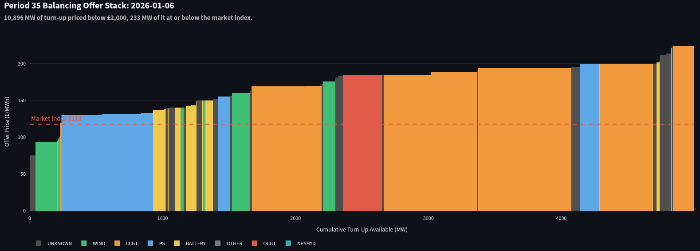
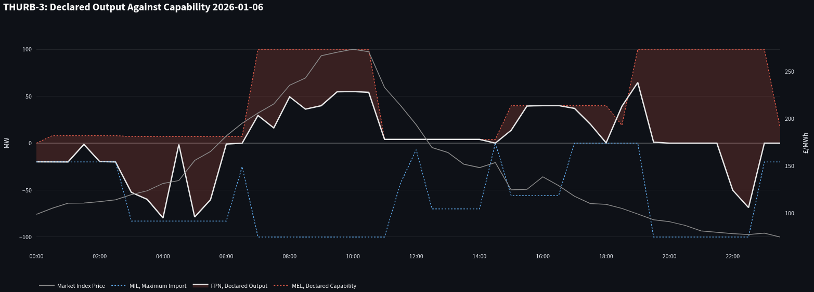
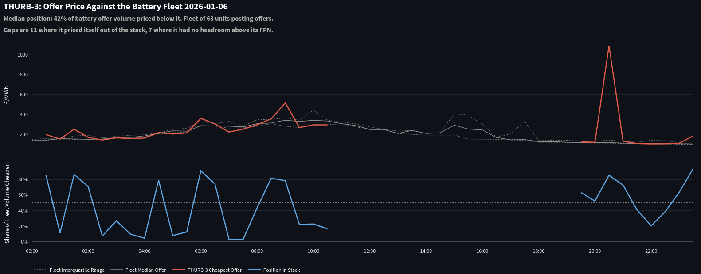
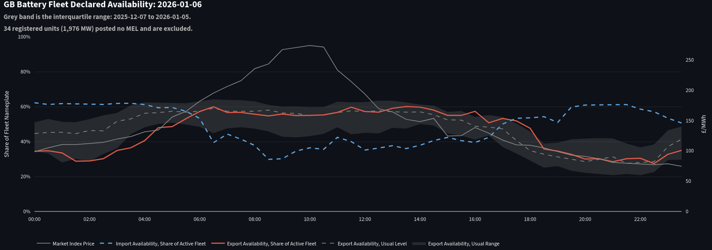

# GB Power Fundamentals Dashboard

A Streamlit dashboard built on Elexon's Insights API, covering the declared
generation stack, the balancing offer stack, and GB battery fleet behaviour.
Runs on cached days or live against the current settlement period.

**Generation**

1. Declared position by fuel type, with the market index price overlaid
2. Value by fuel type, showing what each technology captured
3. Cost of turn-up, tracking the marginal balancing offer price at fixed depths
4. Balancing offer stack for a single settlement period

**Batteries**

5. Single unit envelope, showing declared output against declared capability
6. Position in the battery offer stack, showing where a unit prices itself
7. Battery fleet declared availability

---

## Motivation

This project is meant to simulate a platform like EnAppSys or LCP Enact using
Elexon's public data.

The starting question was how transmission-connected units position themselves
ahead of price. It grew into two views: a market-wide one, and an asset-level one
aimed at storage.

Figures below are from 6 January 2026.

---

## Generation

### Declared Position by Fuel Type



Half-hourly declared output by technology, with the market index price overlaid.
Battery and pumped storage cross below the axis when charging. Interconnectors
cross below it when GB is declaring net export.

1,031,191 MWh of declared exports across the day, peaking at 49,949 MW. Wind
starts at 6.1 GW, troughs at 4 GW ~05:00, and climbs to 16.9 GW by
midnight. Gas holds 22 to 24 GW overnight, peaks at 26.2 GW at 11:30, and falls
to 5.5 GW by the end of the day. The price runs the other way, from £100
overnight to £273 at 10:00 and back to £77 by 22:00.

The nuclear band steps down by 640 MW just after 11:00. That is consistent with
Heysham 2 unit 8 coming off for a planned refuelling outage.

### Value by Fuel Type

Each technology's declared position valued at the market index price, with a
captured price meaning revenue divided by exported volume. Charging and import
volume sits in the cost column rather than the MWh column.

| Fuel | MWh exported | Captured price | Net value |
|---|---|---|---|
| CCGT | 536,773 | £155.20 | £83,309,445 |
| Wind | 221,307 | £130.59 | £28,900,516 |
| Nuclear | 98,575 | £149.26 | £14,326,014 |
| Biomass | 80,751 | £146.89 | £11,861,651 |
| Interconnector | 52,427 | £175.23 | -£5,027,620 |
| Battery | 10,014 | £184.55 | £1,186,822 |
| Pumped storage | 9,881 | £205.12 | £1,028,542 |
| Non-pumped hydro | 9,494 | £173.26 | £1,644,939 |
| OCGT | 3,341 | £197.83 | £661,049 |
| Other | 609 | £209.31 | £94,453 |

UNKNOWN carries the remaining 8,017 MWh, 0.8 percent of the day. It exported at
a captured price of £176.51 and imported £1,349,367 against £1,415,111 of
export revenue, so the bucket buys and sells in near-equal value. That is a
storage signature, and it is 8,017 MWh against 10,014 MWh in the labelled
BATTERY row.

Wind captured £19/MWh less than nuclear on the same day from the same market.
The gap is timing rather than cost: wind generated most heavily through the cheap
evening hours while nuclear ran flat through the £273 morning.

Storage sits at the top because it chooses when to sell. Peakers sit high for the
same reason and run for very little of the day.

Interconnectors are the only negative line. Imports into GB delivered 52,427
MWh worth £9.19m, and exports out of GB cost £14.21m, so the row nets to minus
£5.03m. Averaged across the day the declared net position is 1,691 MW out of
GB, and FUELINST metered outturn puts it at 1,646 MW.

The daily average hides the shape. GB exported 6.3 GW at 05:00 against a £155
index, and by 10:00 the index was £273 and the position had turned round to
0.6 GW of import. The heavy export hours are the cheap ones.

### Cost of Turn-Up



Bid-offer data locks at gate closure so the balancing offer stack for a period is
known before the period starts. This chart takes the marginal offer price at two
fixed depths, 500 MW and 1,500 MW, across all 48 periods.

The level says what turn-up costs. The red band between the lines says how fast
it gets more expensive as the requirement grows. That width measures imbalance
risk rather than price. Median spread on 6 January was £27/MWh.

The grey band behind is the interquartile range of the same period for the past
30 days (25th to the 75th percentile). The dashed line is their median.

The two lines rise with the wholesale price through the morning and then stop.
The 1,500 MW line holds £200 from 07:00 to 12:30 and the 500 MW line runs between
£145 and £160 over the same hours, while the market index carries on to £273.
Turn-up was cheaper than buying in the market at the moment the market was most
stressed.

The band makes the shape of the day readable. Everything below is the 1,500 MW
line, measured against the dashed median for the same settlement period across
the 30 days behind it. On 6 January it sat above that level in every period. The
gap runs about £20 overnight, widens to £100 at the morning peak, stands at £46
at 17:00, and closes to a couple of pounds through the evening. So the balancing
stack was expensive by its own standards all day and still £74 cheaper than the
traded market at the morning peak.

### Balancing Offer Stack



The full offer stack for period 35, meaning 17:00 to 17:30. Bar width is band
volume, bar height is offer price, colour is technology. The dashed line is the
market index.

10,896 MW of turn-up was priced below £2,000 and only 233 MW of it sat at or
below the market index of £118. At the evening peak almost the whole balancing
stack was more expensive than the traded price. Everything under the index is
wind. The cheap depth above it is mostly a 690 MW block of pumped storage at
£130, and gas takes over from £169 for about half the visible width. The x axis
is truncated at 5,000 MW, since the tail beyond that is refusal-priced volume.

This can be read as a crude approximation of the top of the merit order. It ranks the
headroom each unit declared above its FPN by the price asked for it, so units
already flat out drop out of the picture.

Two things separate it from the order NESO dispatches in.

- Offer prices carry opportunity cost and scarcity mark-up on top of fuel.
- NESO departs from price order for network constraints, dynamic parameters and
  reserve holding, so cheap Scottish wind cannot serve a shortage in the south.

Bands are capped at MEL minus FPN. Without that cap the stack overstates
available depth by several gigawatts.

---

## Batteries

### Single Unit Envelope



One BM unit's declared output against its declared capability. MEL is the export
ceiling, MIL is the import floor, and the FPN moves between them.

For a battery the two bounds also read as state of charge. MIL at zero means the
unit cannot import i.e. it is full. MEL at zero means it cannot export i.e. it is
empty. Under the 30-minute rule each bound is the power the unit says it can hold
for half an hour, so MEL of 100 MW stands for 50 MWh of stored energy.

THURB-3 is a 100 MW unit. On 6 January it charged overnight, ran to its MEL of
100 MW at 10:00 into the £273 peak, sat near zero from 11:00 to 14:30, ran at
40 MW into the late afternoon, and charged again after 22:00. From 07:00 to
10:30 it sits at both bounds at once, so the unit was mid-range.

It also shows where the state of charge reading breaks. MEL holds flat at 4 MW
from 11:00 to 15:00 while the unit exports, then steps to 40 MW at 15:00 with no
charging in between. Across the day it declared 329.65 MWh of exports against
276.5 MWh of imports from a starting MEL of zero. Both steps land on EFA block
boundaries, and the fleet panel below shows why that matters.

Net value of the declared position was £29,058, from £62,422 of exports against
£33,364 of imports. About £10,000 of that is margin on 53 MWh carried in from the
day before.

### Position in the Battery Offer Stack



Where the selected unit's cheapest offer sits in the fleet's price distribution,
period by period. Low means near the front of the dispatch queue. High means
priced to sit out. Quantiles are weighted by band volume so a unit posting five
bands does not carry five times the weight of one posting a single band.

This is the daily decision a storage optimiser makes: price low and get called
but sell cheap and spend a cycle, or price high and protect the energy for a
better period.

THURB-3 posted a median cheapest offer of £199 against a fleet median of £194,
so it sat at 42 percent of fleet offer volume across the day. It priced within
consensus rather than taking a distinct view.

The lines break for eighteen periods. THURB-3 posted bid-offer data in every one of 
them. In eleven it had headroom and priced itself out, offering above £2,000 so the 
band never reaches the stack. In the other seven it was pinned at its declared MEL, 
with every band capped out by the headroom test.

### Battery Fleet Declared Availability



Storage declares MEL and MIL under NESO's 30-minute rule, meaning the value is
what the asset can deliver for half an hour given its current charge, redeclared
as that charge changes. Aggregate battery MEL divided by fleet nameplate is then
the share of the fleet the balancing mechanism can reach in each period. The grey
band is the interquartile range of that figure across the 30 days before the day
on screen.

The fleet held export availability between 55 and 60 percent of active nameplate
from 06:30 to 16:30, straight through the £273 morning spike, without drawing
down. It only fell away after 17:00, reaching 30 percent by 20:00, into a market
that had already dropped to £120.

The timing has an explanation. Frequency response is procured in EFA blocks, and
MEL changes cluster hard on their boundaries. At 15:00, 52 of the 117 registered
battery units change MEL at once, and all six boundary periods are in the top
nine of 48 by how many units move. The changes also offset. At 11:00, 728 MW of
MEL moves and 50 MW of it nets, and every boundary runs at least three to one.
Discharging would push units the same way. Contract handover would not.

So a large share of what this curve reads as unavailable energy is capacity held
under contract, and contracted capacity does not answer to price. That is why
availability sits flat through a £273 morning.

34 registered units carrying 1,976 MW posted no MEL at all that day and are
excluded from the denominator.

---

## Method Notes


**Fuel classification.** Elexon does not label storage. Batteries are identified
by symmetric registered import and export capacity, ratio window 0.85 to 1.2,
restricted to units unlabelled or labelled OTHER so pumped storage keeps its own
category. A hardcoded list patches asymmetric registrations. This agrees with the
`*B-n` naming convention except on West Burton, where the B is the station name
and the units are CCGTs.

The residual shows as UNKNOWN rather than dropped. On 6 January it is 8,017 MWh
with cashflows shaped like storage against 10,014 MWh in the labelled battery
row, so some of it is storage the ratio test missed and the fleet denominator is
smaller than the real fleet.

**Interconnectors.** Every Interconnector User registers a pair of BM units per
cable, one generation and one demand. Physical notifications carry sign, so
summing both legs nets the flow. Elexon labels almost none of these with a fuel
type, so the `I` unit type is the classifier and the ID carries the rest: the
last character of the prefix is G or D for the leg, the remainder identifies the
cable.

Each cable has three registrations: traders, the cable owner, and NESO in an
administrator role. The NESO pairs declared zero MWh against 145,443 MWh from
users on 6 January, so they are held out. Owner units carry 447 MW mean against
1,244 MW for traders and correlate at 0.02, so they stay in.

`interconnectors.py` matches prefix to cable on RMSE against FUELINST outturn.
Seven resolve between 9 and 32 MW, and summed across cables declared sits 46 MW
from outturn on average. IG, II and IM are too small to separate. IE cannot be
resolved this way because eight cable owners register under it.

**Offer band volumes.** In bid-offer data, `levelFrom` and `levelTo` are the
level at the start and end of the settlement period, not the two edges of a band.
A pair is a single mark on a number line measured from the FPN. Band widths come
from differencing consecutive marks within a unit, with the first band measured
from the FPN itself.

**Stack ordering.** The stack sorts globally by price, so a unit's outer band
could in principle sit ahead of the inner one behind it.`monotonicity_check` tests
that rather than assuming it, on raw data before the filters.

**MEL statistics.** The merit order caps headroom at the lowest MEL in the
period, since that is the binding constraint. The unit envelope draws the
highest, since that is the profile the operator declared. Both are labelled on
the charts.

**Reference bands.** `build_history.py` runs 30 days and keeps only the derived
quartiles, a few thousand values rather than the raw bid-offer data behind them.
Clock change days are skipped since they do not have 48 periods.


---

## Limitations

**No day-ahead price.** GB day-ahead auction results are licensed by N2EX and
EPEX SPOT. ENTSO-E stopped publishing GB on 15 June 2021, since the post-Brexit
Trade and Cooperation Agreement removed the obligation to submit. The overlay
uses Elexon's Market Index Data, the volume-weighted average of short-term trades
in each period. It tracks the
day-ahead shape but is measured much closer to delivery, so the price shown here
is downstream of the decision it is being used to explain. Everything valued in
this dashboard is valued at that price. Balancing and ancillary revenue are both
excluded from it.

**No neighbouring prices.** Elexon publishes GB only, so the direction of an
interconnector flow is observed and the price difference driving it is not.

**Coverage gaps.** Embedded generation below the transmission system has no BM
unit, so GB solar does not appear at all. Demand and wind forecasts are not
pulled, so the stack has no counterparty and there is no way to say whether 50 GW
of declared generation is comfortable or tight.

**Storage is harder to read than it looks.** A megawatt of battery turn-up and a
megawatt of CCGT turn-up are the same unit of measurement and different things,
because the battery's is good for around half an hour. The fleet chart measures
availability rather than charge, so a fleet with stored energy but derated power
capability reads low. And a unit holding capacity for a frequency response
contract prices high or does not post at all. The EFA clustering identifies that
at fleet level but nothing identifies it for a single unit.

**Reference bands are 30 days.** The window sets a level to compare against and
is too short to carry a statistical claim. The storage fleet also grows fast
enough that a longer window would mix different fleets.

---

## Running It

```bash
pip install -r requirements.txt
python data_pull.py       # parquet cache for the demo days
python build_history.py   # 30 day reference bands, optional
python interconnectors.py 2026-01-06   # cable checks, optional
streamlit run app.py
```

`data_pull.py` pulls PN, MELS, MILS, SEL, MID and BOD per settlement period for
each demo day. The four physical datasets fetch concurrently and each runs its
own thread pool across periods.

`build_history.py` caches one small file per day, so a rerun picks up where it
stopped. With no arguments it builds 7 December 2025 to 5 January 2026, the 30
days behind the bands in these screenshots. The sidebar also offers a rolling
window covering the 30 days before whichever date is selected. 

Live mode pulls today up to the current settlement period plus two, cached for
three minutes with a manual refresh. Settlement periods are derived from
Europe/London, so British Summer Time is handled.

---

## Next Steps

- **Per-cable interconnector breakdown.** The stack carries interconnectors as
  one band. Seven of the eleven user prefixes are resolved in `constants.py`, so
  splitting the band by cable would show which neighbour is pulling.
- **Bid-offer acceptances (BOALF) overlaid on the stack.** Shows which offers
  NESO actually took, turning a declared-capability picture into an outcome
  picture. Cross-referencing against the `soFlag` would separate energy actions
  from constraint actions. That is the largest gap in the merit order panel.
- **The bid stack.** Same as offers but  with negative pair IDs and the bid column,
  giving the long case alongside the short one.
- **Longer reference window.** Ninety days would tighten the bands, at the cost
  of mixing a smaller storage fleet with the current one.
- **Clock change days in live mode.** GB has 46 settlement periods on the last
  Sunday in March and 50 on the last Sunday in October. `build_history.py`
  already skips them and live mode still assumes 48.

---

## Repo Layout

| File | Contents |
|---|---|
| `constants.py` | Values used by more than one module, so none can drift apart |
| `data_pull.py` | Every Elexon call, the fuel classifier and the parquet cache |
| `charts.py` | Figure construction and the derived series behind it |
| `build_history.py` | Reference bands across a window of days |
| `interconnectors.py` | Cable table, double-count tests, prefix to cable matching |
| `app.py` | Streamlit layout and caching |

---
